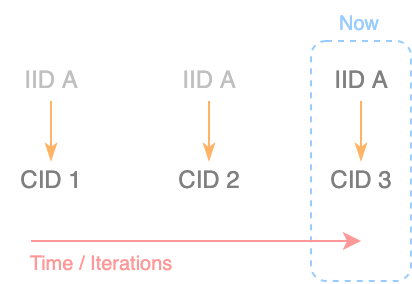

# Interplanetary mind-map (IPMM)

- [Interplanetary mind-map (IPMM)](#interplanetary-mind-map-ipmm)
    - [Overview](#overview)
        - [Abstract](#abstract)
        - [Current stage](#current-stage)
        - [On terminology](#on-terminology)
    - [Meaning is subjective](#meaning-is-subjective)
        - [Meaning overview](#meaning-overview)
        - [Meaning in communication](#meaning-in-communication)
        - [Meaning in reasoning](#meaning-in-reasoning)
        - [Capturing meaning](#capturing-meaning)
    - [Everything is an abstraction](#everything-is-an-abstraction)
        - [Perceptual abstractions](#perceptual-abstractions)
        - [Language as system of abstractions](#language-as-system-of-abstractions)
        - [Computation as abstraction](#computation-as-abstraction)
        - [Encapsulating meaning into abstractions](#encapsulating-meaning-into-abstractions)
    - [Information should aim to be self-describing](#information-should-aim-to-be-self-describing)
        - [Self-describing data structure](#self-describing-data-structure)
        - [Instances of self-description](#instances-of-self-description)
    - [A different paradigm](#a-different-paradigm)
        - [Conflicts with language](#conflicts-with-language)
        - [Use-cases](#use-cases)
    - [Technical mapping](#technical-mapping)
        - [Node](#node)
        - [MID - Mind identifier](#mid---mind-identifier)
        - [Note](#note)
        - [Property](#property)
        - [CID - Content identifier](#cid---content-identifier)
        - [IID - Intent identifier](#iid---intent-identifier)
        - [AREF - `Abstraction` reference](#aref---abstraction-reference)
    - [FAQ](#faq)
        - [Comparison with the Semantic Web](#comparison-with-the-semantic-web)
        - [Project philosophy](#project-philosophy)
- [Pseudo Interplanetary mind-map (PIPMM)](#pseudo-interplanetary-mind-map-pipmm)
    - [Overview](#overview-1)
    - [Compromises](#compromises)
    - [Repositories](#repositories)
    - [Installation](#installation)
    - [Exploration](#exploration)
- [Get in touch](#get-in-touch)

## Overview

### Abstract

The `Interplanetary mind-map` (`IPMM`) is a [long term project](history.md) that aims to build a system of information that deals with extremely large levels of complexity, unattainable with current software architectures, and consequently increase our reasoning and communication capacities at individual and collective levels.

`IPMM` endorses 3 fundamental assumptions:

1. [Meaning is subjective](#meaning-is-subjective)  
    The `meaning` given to specific `information` set is unique to each mind, as it is the product of an extremely complex cloud of associations. The word `minformation` is used to make this explicit. We need a system that aligns to each subject's `meaning`.
2. [Everything is an abstraction](#everything-is-an-abstraction)  
    The single most fundamental form to manage complexity are `abstractions`. `Abstraction malleability` (facilitating their access, creation, re-use, maintenance and evolution) is fundamental to maximize their quality (the signal-to-noise ratio they can capture for their specific purpose).
3. [Information should aim to be self-describing](#information-should-aim-to-be-self-describing)  
   To capture complexity and maximize interoperability, composability and understanding of information, there can't be external dependencies, `information` should not require external context to be used, computed or understood.

> `IPMM` is a distributed system of coherent `abstraction` composition around `self-describing` `meaning-units`.

These assumptions force digital `information` to be structured connected and nested in a different new way. It enables a new paradigm for reasoning, communication and potentially computation where the entire system of `information` revolves around the particular ontologies and `abstractions` (language) of each mind allowing to adapt to each person needs, as opposed to subordinating people to the pre-assumptions, bias and incentives of software creators.

### Current stage

Currently, `Interplanetary mind-map` aims to create a conceptual framework that is representative of the nature of `meaning` and the flow of `minformation` that can be mapped in technical implementation that can maximize its utility across most software domains.

[Pseudo-Interplanetary mind-map](#pseudo-interplanetary-mind-map-pipmm) is a working prototype where the system fundamental assumptions and constructs are being explored.

A tool for reasoning as a first MVP is on the works and looking for collaborations. [Get in touch](#get-in-touch).

### On terminology

 `IPMM` uses a lot of unique terminology and a particular narrowed meaning in certain words, this is necessary in order to make explicit certain subtleties within the framework. For a new reader, it may be confusing to read. In the future, likely, the terminology can be simplified, but at the current stage, while developing the conceptual, framework is necessary to optimize for the semantic-clarity of those who work with it.

 Many references of this documentation are pointing to [my personal instance](https://xavivives.com/#?expr=[%22i12D3KooWBSEYV1cK821KKdfVTHZc3gKaGkCQXjgoQotUDVYAxr3clzfmhs7a%22,[[%22i12D3KooWBSEYV1cK821KKdfVTHZc3gKaGkCQXjgoQotUDVYAxr3c2lf4dbua%22,%22i12D3KooWBSEYV1cK821KKdfVTHZc3gKaGkCQXjgoQotUDVYAxr3cdzbeskxq%22]]]&) (Xavi's) of `PIPMM`, where more up-to-date and extensive definitions can be found.

## Meaning is subjective

### Meaning overview

Each word carries `meaning`. While a dictionary may define a word based on how its used within a culture, each of us gives a significant different meaning to them. Every experience that we have around an object/word/concept shapes its meaning.

While the grammar of a language allow us to represent it in a "standardized" way (information), its interpretation will always be subjective due to our differing associations (minformation).

- [information](https://xavivives.com/#?expr=[%22i12D3KooWBSEYV1cK821KKdfVTHZc3gKaGkCQXjgoQotUDVYAxr3clzfmhs7a%22,[[%22i12D3KooWBSEYV1cK821KKdfVTHZc3gKaGkCQXjgoQotUDVYAxr3c2lf4dbua%22,%22i12D3KooWBSEYV1cK821KKdfVTHZc3gKaGkCQXjgoQotUDVYAxr3cdzbeskxq%22],[%22i12D3KooWBSEYV1cK821KKdfVTHZc3gKaGkCQXjgoQotUDVYAxr3c2lf4dbua%22,%22i12D3KooWBSEYV1cK821KKdfVTHZc3gKaGkCQXjgoQotUDVYAxr3czsjxwj5q%22]]]&): `Data` that is aimed to be interpreted.

- [minformation](https://xavivives.com/#?expr=[%22i12D3KooWBSEYV1cK821KKdfVTHZc3gKaGkCQXjgoQotUDVYAxr3clzfmhs7a%22,[[%22i12D3KooWBSEYV1cK821KKdfVTHZc3gKaGkCQXjgoQotUDVYAxr3c2lf4dbua%22,%22i12D3KooWBSEYV1cK821KKdfVTHZc3gKaGkCQXjgoQotUDVYAxr3cdzbeskxq%22],[%22i12D3KooWBSEYV1cK821KKdfVTHZc3gKaGkCQXjgoQotUDVYAxr3c2lf4dbua%22,%22i12D3KooWBSEYV1cK821KKdfVTHZc3gKaGkCQXjgoQotUDVYAxr3cxhm6fu5a%22]]]&): The product of `data` that has been interpreted by a particular subject. A completely subjective experience.

- [meaning](https://xavivives.com/#?expr=[%22i12D3KooWBSEYV1cK821KKdfVTHZc3gKaGkCQXjgoQotUDVYAxr3clzfmhs7a%22,[[%22i12D3KooWBSEYV1cK821KKdfVTHZc3gKaGkCQXjgoQotUDVYAxr3c2lf4dbua%22,%22i12D3KooWBSEYV1cK821KKdfVTHZc3gKaGkCQXjgoQotUDVYAxr3cdzbeskxq%22],[%22i12D3KooWBSEYV1cK821KKdfVTHZc3gKaGkCQXjgoQotUDVYAxr3c2lf4dbua%22,%22i12D3KooWBSEYV1cK821KKdfVTHZc3gKaGkCQXjgoQotUDVYAxr3chp6gtfwq%22]]]&): Is all the `minformation` that a given subject needs to relate and to create certainty around a given object. Is complex and fuzzy, only exists inside a subject's body-mind system and can't be communicated in a lossless form, as its the product of the subject life experience.

Example:
> An article on a newspaper is `information`. It is `data` sitting there awaiting to be read.
> When someone reads the text, the `information` becomes subjective based on the subject's political views, preexisting knowledge, current emotional state, authorship of the article, all the associations with each word in the text... The `data` is now `minformation` instead. The product of the `minformation` with all the associations that had conditioned its interpretation conforms the `meaning` that subject gives to that article.

### Meaning in communication

Natural language requires to have a significant degree of [shared meaning](https://xavivives.com/#?expr=[%22i12D3KooWBSEYV1cK821KKdfVTHZc3gKaGkCQXjgoQotUDVYAxr3clzfmhs7a%22,[[%22i12D3KooWBSEYV1cK821KKdfVTHZc3gKaGkCQXjgoQotUDVYAxr3c2lf4dbua%22,%22i12D3KooWBSEYV1cK821KKdfVTHZc3gKaGkCQXjgoQotUDVYAxr3cdzbeskxq%22],[%22i12D3KooWBSEYV1cK821KKdfVTHZc3gKaGkCQXjgoQotUDVYAxr3c2lf4dbua%22,%22i12D3KooWBSEYV1cK821KKdfVTHZc3gKaGkCQXjgoQotUDVYAxr3cgwyycz5q%22]]]&) between its users, otherwise communication wouldn't be possible.

Reading the same words may have the effect of seeming that two subjects will understand the same thing. This [fallacy of shared meaning](https://xavivives.com/#?expr=[%22i12D3KooWBSEYV1cK821KKdfVTHZc3gKaGkCQXjgoQotUDVYAxr3clzfmhs7a%22,[[%22i12D3KooWBSEYV1cK821KKdfVTHZc3gKaGkCQXjgoQotUDVYAxr3c2lf4dbua%22,%22i12D3KooWBSEYV1cK821KKdfVTHZc3gKaGkCQXjgoQotUDVYAxr3cdzbeskxq%22],[%22i12D3KooWBSEYV1cK821KKdfVTHZc3gKaGkCQXjgoQotUDVYAxr3c2lf4dbua%22,%22i12D3KooWBSEYV1cK821KKdfVTHZc3gKaGkCQXjgoQotUDVYAxr3cgpk6ijkq%22]]]&) is the root cause of most communication issues.

`Interplanetary mind-map` enables to make explicit the difference in `meaning` between subjects, minimizing miscommunication and conflict by providing tools to map each-other's `meaning`.

### Meaning in reasoning

Having `shared meaning` is a virtue for communication but its a huge drawback for thinking.

The quality of our reasoning is directly tight to the quality of our `abstractions`. The use of "common language" `abstractions` constrains the creation and evolution of our own unique `abstractions` that can better fullfil our particular needs.

With a system that supports us in expressing our particular `meaning` around a concept, we become in in full control of our own particular `abstractions`, better capturing our reality and enhancing our reasoning.

Similarly, any piece of software uses the same set of `abstractions` for all its user base (user interface, functions, options, visualizations...). This translates into only allowing its users to transform, compute, visualize and make sense of information based on the scenarios and needs that the software creators have considered. To maximize good reasoning users must be able to shape and render `information` in a way that is natural to them.

`Interplanetary mind-map` recognizes that humans operate with `minformation` and not `information`, and to maximize our particular virtues, the system should be build around our particular `meaning`.

### Capturing meaning

`IPMM` can be understood as a "best effort" to maximize the digital caption of `meaning`.  The following are what `IPMM` considered its "primitives", and aims to recreate digitally.

- [meaning unit](https://xavivives.com/#?expr=[%22i12D3KooWBSEYV1cK821KKdfVTHZc3gKaGkCQXjgoQotUDVYAxr3clzfmhs7a%22,[[%22i12D3KooWBSEYV1cK821KKdfVTHZc3gKaGkCQXjgoQotUDVYAxr3c2lf4dbua%22,%22i12D3KooWBSEYV1cK821KKdfVTHZc3gKaGkCQXjgoQotUDVYAxr3cdzbeskxq%22],[%22i12D3KooWBSEYV1cK821KKdfVTHZc3gKaGkCQXjgoQotUDVYAxr3c2lf4dbua%22,%22i12D3KooWBSEYV1cK821KKdfVTHZc3gKaGkCQXjgoQotUDVYAxr3chp6gtfwq%22]]]&): It is meaning of a given object at a given time by a given subject.
- [meaning unit projection](https://xavivives.com/#?expr=[%22i12D3KooWBSEYV1cK821KKdfVTHZc3gKaGkCQXjgoQotUDVYAxr3clzfmhs7a%22,[[%22i12D3KooWBSEYV1cK821KKdfVTHZc3gKaGkCQXjgoQotUDVYAxr3c2lf4dbua%22,%22i12D3KooWBSEYV1cK821KKdfVTHZc3gKaGkCQXjgoQotUDVYAxr3cdzbeskxq%22],[%22i12D3KooWBSEYV1cK821KKdfVTHZc3gKaGkCQXjgoQotUDVYAxr3c2lf4dbua%22,%22i12D3KooWBSEYV1cK821KKdfVTHZc3gKaGkCQXjgoQotUDVYAxr3cdeplwy4q%22]]]&): Is a representation attempt of a `meaning unit`, it is inherently incomplete and distorted, usually expressed in the form of language. A `meaning unit` can have an infintie number of `meaning unit projections` that represent different aspects of it.
- [intended meaning](https://xavivives.com/#?expr=[%22i12D3KooWBSEYV1cK821KKdfVTHZc3gKaGkCQXjgoQotUDVYAxr3clzfmhs7a%22,[[%22i12D3KooWBSEYV1cK821KKdfVTHZc3gKaGkCQXjgoQotUDVYAxr3c2lf4dbua%22,%22i12D3KooWBSEYV1cK821KKdfVTHZc3gKaGkCQXjgoQotUDVYAxr3cdzbeskxq%22],[%22i12D3KooWBSEYV1cK821KKdfVTHZc3gKaGkCQXjgoQotUDVYAxr3c2lf4dbua%22,%22i12D3KooWBSEYV1cK821KKdfVTHZc3gKaGkCQXjgoQotUDVYAxr3cz6zpqnbq%22]]]&): It is the `meaning unit` that a `meaning projection` aims to express.
- [meaning unit pointer](https://xavivives.com/#?expr=[%22i12D3KooWBSEYV1cK821KKdfVTHZc3gKaGkCQXjgoQotUDVYAxr3clzfmhs7a%22,[[%22i12D3KooWBSEYV1cK821KKdfVTHZc3gKaGkCQXjgoQotUDVYAxr3c2lf4dbua%22,%22i12D3KooWBSEYV1cK821KKdfVTHZc3gKaGkCQXjgoQotUDVYAxr3cdzbeskxq%22],[%22i12D3KooWBSEYV1cK821KKdfVTHZc3gKaGkCQXjgoQotUDVYAxr3c2lf4dbua%22,%22i12D3KooWBSEYV1cK821KKdfVTHZc3gKaGkCQXjgoQotUDVYAxr3c6ardl2ma%22]]]&): A sign, a word, a set of data that when interpreted makes the subject recall a specific `meaning-unit`.
- [meaning unit continuity essence](https://xavivives.com/#?expr=[%22i12D3KooWBSEYV1cK821KKdfVTHZc3gKaGkCQXjgoQotUDVYAxr3clzfmhs7a%22,[[%22i12D3KooWBSEYV1cK821KKdfVTHZc3gKaGkCQXjgoQotUDVYAxr3c2lf4dbua%22,%22i12D3KooWBSEYV1cK821KKdfVTHZc3gKaGkCQXjgoQotUDVYAxr3cdzbeskxq%22],[%22i12D3KooWBSEYV1cK821KKdfVTHZc3gKaGkCQXjgoQotUDVYAxr3c2lf4dbua%22,%22i12D3KooWBSEYV1cK821KKdfVTHZc3gKaGkCQXjgoQotUDVYAxr3cqkp7a4ja%22]]]&): The `minformation` set of a `meaning-unit` that does not change and allows for the `meaning-unit` to evolve while keep being referred by its `meaning unit pointers`.

Example:

> Each person has a different `meaning` for what car is. While a lot of this `meaning` is shared, there is a cloud of experiences, associations, emotions, knowledge, understandings... that conforms to our particular understanding of a car. This cloud, in a particular moment, for a particular mind is a `meaning unit`.
>
> If I try to explain what a car means to me, I will aim to express its `intended meaning` although I only will be able to express part of the cloud that I have in my head, there are things that I don't remember, there are associations of the car that I have that I'm not aware of, I'm limited on time for what I can express, and even if I could do the above the limits of the language will only be able to communicate part of it. That's why any expression of what a car means to me is just an `meaning unit projection`.
>
> Despite a `meaning unit` not being representable and constantly evolving we still can refer to a "car". There is an essential set of `minformation` of what constitutes a car that does not change, the `meaning unit continuity essence`.
>
> When we see a car or read the word "car", we recall the `meaning unit` of a car. Both, the image of a car and the word "car" are `meaning unit pointers`.

If we're able to connect each `meaning unit` with all its related `meaning unit`s that conform it, we end up with a `map of meaning` that reassembles how our mind is structured. Our personal digital ontology, our "mind-map".

## Everything is an abstraction

### Perceptual abstractions

We can't directly perceive reality. Our sensory receptors filter specific ranges of light, sound, touch... corresponding organs may do further processing, up until we can interpret information with our conscious and unconscious minds. At every step in that path, `minformation` is reduced and transformed in the form of `abstractions`.

- [Abstraction](https://xavivives.com/#?expr=[%22i12D3KooWBSEYV1cK821KKdfVTHZc3gKaGkCQXjgoQotUDVYAxr3clzfmhs7a%22,[[%22i12D3KooWBSEYV1cK821KKdfVTHZc3gKaGkCQXjgoQotUDVYAxr3c2lf4dbua%22,%22i12D3KooWBSEYV1cK821KKdfVTHZc3gKaGkCQXjgoQotUDVYAxr3cdzbeskxq%22],[%22i12D3KooWBSEYV1cK821KKdfVTHZc3gKaGkCQXjgoQotUDVYAxr3c2lf4dbua%22,%22i12D3KooWBSEYV1cK821KKdfVTHZc3gKaGkCQXjgoQotUDVYAxr3cnnjsotia%22]]]&): An `abstraction` is the expression of a pattern of information that captures the essence that allows it to better serve in the specific context where is used. An `abstraction` is the product of computation, where input information is reduced, transformed and re-grouped to increase the signal-to-noise, reducing entropy and enabling to to deal with greater complexity.

Example:
> We are constantly sensing light and sound, but not all of its is perceived equal. We ignore some signals and enhance others (improving signal-to-noise ratio). We can isolate the visual shape and the sound of a "car" within it surroundings recognizing it as a 3D object (improving signal-to-noise ratio). Each signal-to-noise ratio improvement produces an abstraction.

### Language as system of abstractions

Humans are unique in their capacity to create abstractions that are not only perceptual and
natural language is its higher form.

A `word` is short and simple but its pointing to huge amounts of `meaning` without having to directly handle the complexity that they represent.

By composing clauses made of `words` we can capture even larger amount of complexity that better describe the meaningful elements of reality . We can wrap these clauses as new `abstractions` to further compress complexity (ideas, models, frameworks...). This nesting process can continue indefinitely,  creating higher level `abstractions` without no upper bound.

Language can be understood as a formal system of `abstraction` composition, that produces higher-level `abstractions` as a result.

Example:
> A "car" is a 3D object with specific shape and sound, composed of many parts, that uses complex physics and technology to function. By using the word "car" we can relate to it without having to relate to its complexity.
> A clause like "An electric-car", is in itself a higher level abstraction, representing more complexity than the word "car" on its own.

Language and words are not the only systems we have to generate `abstractions`. Anything that we can conceive and have some "boundaries" can be understood as an `abstraction`.

### Computation as abstraction

A computation is essentially the process of generating better `abstractions`, simplifying an aspect of reality to facilitate our relationship with it. But the  computation in itself can also be conceive as `abstraction` that transforms `abstractions`, making  code, functions, apps or machine learning models `abstractions` as well.

### Encapsulating meaning into abstractions

In `IPMM` anything that has `meaning` can be expressed as multiple `meaning unit projection` and understood as an `abstraction`, which means that everything can have its digital representation. The result is our personal language, a map of `meaning` of our particular mind.

Example:
> The idea of "My car" is a `meaning unit` and it can be represented as an arbitrary list of `meaning unit projections`:
> Its name, a description, pictures, its documentation... Each of them may be composed of words that are in themselves other `meaning unit projections`.

Example:
> The idea of "filter" is a `meaning unit`, as `meaning unit projections` may have a "definition" and a "pure function" that takes other `meaning unit projections` as arguments an it renders a filtered result.

Facilitating a coherent creation, evolution, re-use, and maintenance of `abstractions`, that map into how we think, is what enables better reasoning and communication, and the goal of `IPMM` is to support this process. A [different methodology](#new-methodology) is necessary to support this process.

## Information should aim to be self-describing

Because `meaning` is intrinsically subjective and only part of it is shared, there would always be a gap where the consumer of a given `information` would not be able to assign the same `meaning` as its author. For the consumer to approximate its understanding to the `intended meaning` it needs more `contextual information`.

What we can do to minimize this "gap" is to attempt to make `contextual information` part of the `information`.

- [Self-describing](https://xavivives.com/#?expr=[%22i12D3KooWBSEYV1cK821KKdfVTHZc3gKaGkCQXjgoQotUDVYAxr3clzfmhs7a%22,[[%22i12D3KooWBSEYV1cK821KKdfVTHZc3gKaGkCQXjgoQotUDVYAxr3c2lf4dbua%22,%22i12D3KooWBSEYV1cK821KKdfVTHZc3gKaGkCQXjgoQotUDVYAxr3cdzbeskxq%22],[%22i12D3KooWBSEYV1cK821KKdfVTHZc3gKaGkCQXjgoQotUDVYAxr3c2lf4dbua%22,%22i12D3KooWBSEYV1cK821KKdfVTHZc3gKaGkCQXjgoQotUDVYAxr3cclw35kma%22]]]&): Is the quality of `information` of not needing external `information`/context to be used or understood. This definition should not be read in absolute terms, but as a platonic attribute that any `abstraction` should aim for.

    `Self-describing` can be understood as a spectrum, where the more `self-describing` an `abstraction` of a `meaning unit projection` is, the more capacity to be interoperable used and understood is (does not have contextual dependencies).

`IPMM` architecture is designed so that the `meaning unit pointer` (mostly but not exclusively "words") can't be separated from the `meaning` or `computation` that a the particular `mind` that created it intended for them. Every piece of `information` in the system carries all what is necessary to be computed or understood within itself.

### Self-describing data structure

An instance of a `meaning unit projection` within the `IPMM` framework is called a `note`.

The main mechanism used to achieve `self-description` is by nesting `notes` within `notes`. This means that any element of a `note` can in itself be a `note` allowing for extremely complex nested objects. [`IPLD`](https://ipld.io/docs/) is used to represent this data structures.

The reason the word "nesting" is used as opposed to "linking" is because the references in a `note` are assumed to be part of the `note` and not an outside thing. The nested `notes` are necessary to contribute to the `meaning` for the super-`note` to be understood . This is very different from the hyperlink pointing to a "web page".

> A simple analogy that may help to understand the data representation of the `self-describing` quality would be to imagine it as a "[Merkle Tree](https://en.wikipedia.org/wiki/Merkle_tree)" of `meaning`, where each node is a `meaning unit projection` made of other `meaning units projection`s. The parent nodes are a product of the children nodes as oppose to something just referenced.

### Instances of self-description

The `self-describing` quality is manifested in multiple ways in the system:

- `Self-describing note`: This is a quality that the author of a `note` should aim for, and is what allows the overall ontology to grow and be coherent. It can't be enforced by the system, but it can be incentivized.
- `Self-describing type`: The "key" of each `note` `property` is nothing but a `meaning unit pointer` to the `type note`. A `type note` is a `note` that contains all the information to be processed by a computer (classic type system), but also the information to be semantically understood by a `mind`. The development of this type-system is one of the critical aspects of the development of the project. [Interested in helping?]((#get-in-touch))
- `Self-describing transforms`: `Transforms` are `notes` that can compute other `notes`. They can be filters, renders, parsers, functions... Being `self-describing` means that they don't have "dependencies". Any code they need must be within the `note`, either directly or as a nested `note`.
- `Self-describing text`: We can enable a system of [transclusions](https://en.wikipedia.org/wiki/Transclusion) where words, paragraphs and other text structures are nothing but the transcluded `properties` of a `note` and at the same time are pointers to that `note`. By having a semantic interface we can guarantee that the transclusion will still make sense in the future. This enables the capacity for each word to be `self-describing` which means that we do not need to rely on the ambiguous definitions of a global dictionary and instead we can create extremely explicit text where a resolution to its meaning can be added progressively. It also means that when writing (an article for example) the context required to make the point is extremely minimized, as each concept/word can be self-explanatory. This type of text format is currently referred to as [interplanetary-text](interplanetary-text.md) and is the  main focus of exploration of the project as is where semantics meet the classical type system or where the `mind` meets the computer.

## A different paradigm

### Conflicts with language

Many of the ideas described here (an others not captured in the /docs yet), require a different way to relate to language. It requires to break grammar and social norms and "force" language out of its ambiguity. That may seem antagonistic to the idea of mapping `information` like your `mind`, and in a way it is. I'll argue that it does not change its structure but it sharpens the boundaries of `meaning` instead. It is in this process where insights, connections, and better `abstractions` emerge. The `mind` is retrofitted with the product of the system gaining structure and clarity out of it.

One of the conflicts is in using language for communication vs language for reasoning/meaning making. We're used to do everything with the former, and using it for reasoning and creating meaning for one-self seems artificial. And it makes it unnatural to use for communication.

Example:
> I've been [publishing my `abstractions` as a newsletter](https://xavivives.com/#?expr=[%22i12D3KooWBSEYV1cK821KKdfVTHZc3gKaGkCQXjgoQotUDVYAxr3clzfmhs7a%22,[[%22i12D3KooWBSEYV1cK821KKdfVTHZc3gKaGkCQXjgoQotUDVYAxr3c2lf4dbua%22,%22i12D3KooWBSEYV1cK821KKdfVTHZc3gKaGkCQXjgoQotUDVYAxr3ck45ed5ca%22]]]&), and while they're extremely clear and accurate to me, they take a lot of effort for a reader not familiar with my `meaning units`, they need to map them into their mind. In a "normal" text you just "assume" your own meaning.

Because of the `abstraction malleability` of the system, I'm certain that new constructs can emerge that enable a fine balance between communication and reasoning.

Example:
> A simple approach to that will be for example an article written with "communication style" but all its words map to a more "reasoning style".

Another tension between communication vs reasoning is that the system forces self-consistency over shared consensus. This is not how most people work, the needs for belonging, acceptance, validation... are extremely powerful forces and shape most social interactions.

Example:
> Take [my own idea of abstraction](https://xavivives.com/#?expr=[%22i12D3KooWBSEYV1cK821KKdfVTHZc3gKaGkCQXjgoQotUDVYAxr3clzfmhs7a%22,[[%22i12D3KooWBSEYV1cK821KKdfVTHZc3gKaGkCQXjgoQotUDVYAxr3c2lf4dbua%22,%22i12D3KooWBSEYV1cK821KKdfVTHZc3gKaGkCQXjgoQotUDVYAxr3cdzbeskxq%22],[%22i12D3KooWBSEYV1cK821KKdfVTHZc3gKaGkCQXjgoQotUDVYAxr3c2lf4dbua%22,%22i12D3KooWBSEYV1cK821KKdfVTHZc3gKaGkCQXjgoQotUDVYAxr3cnnjsotia%22]]]&) . Redefining what "abstraction" means can viewed as a grandiose statement. [The wikipedia page on "abstraction"](https://en.wikipedia.org/wiki/Abstraction) is quite extensive and mentions 11 different disciplines where is used, and here I go defining it in my own terms. Sharing my meaning makes me quite vulnerable. Nevertheless each of give a particular meaning to the idea of  "abstraction", and we use it everywhere but never being explicit about it. What it is like to communicate exposing your own meaning?

Learning to identify `meaning unit`s and wrap them in `self-describing` `notes` requires some training. It is quite analogous to [code refactoring](https://en.wikipedia.org/wiki/Code_refactoring#techniques), where if you don't take care of your repo, it can rapidly become a useless mess. Tooling can make a world of difference, but it can't replace the skill.

With all the above, I'm certain that `IPMM` won't be "plug & play" tool. It needs training, its benefits are compounding over time and multiplied by the number of domains its used. If anything it will be a different way to understand language and information.

### Use-cases

A system that embraces the above primitives is hard to imagine. The following are a set of use-cases and ideals it pursues that may help to further understand and materialize `IPMM` proposal.

The use-cases are biased towards "semantic" domains. In the current software paradigm it translates to  social networks, chat apps, forums, articles, news, productivity tools, note-taking... In the `IPMM` paradigm all of those are the same thing, a system of creating, maintaining and sharing `meaning units` with adaptable user interfaces that require little specialized computation (filtering, sorting, rendering, timers). While the goal of `IPMM` is to eventually be used in any software category its too early to evaluate how far this framework can be pushed.

- **Perfect traceability**. `Minformation` is born in a specific mind and its expression in the system can't be separated from its source. The evolution of each `note` can be traced and referenced all the way  back to its origin.

- **Explicit communication**. Because each word can carry its full `meaning` and does not rely on the pre-assumed ambiguous definition of a dictionary, the semantic field of a word is narrowed, and the [semantic clarity](https://xavivives.com/#?expr=[%22i12D3KooWBSEYV1cK821KKdfVTHZc3gKaGkCQXjgoQotUDVYAxr3clzfmhs7a%22,[[%22i12D3KooWBSEYV1cK821KKdfVTHZc3gKaGkCQXjgoQotUDVYAxr3c2lf4dbua%22,%22i12D3KooWBSEYV1cK821KKdfVTHZc3gKaGkCQXjgoQotUDVYAxr3cdzbeskxq%22],[%22i12D3KooWBSEYV1cK821KKdfVTHZc3gKaGkCQXjgoQotUDVYAxr3c2lf4dbua%22,%22i12D3KooWBSEYV1cK821KKdfVTHZc3gKaGkCQXjgoQotUDVYAxr3cnp2s7dqa%22]]]&) increased.

- **Atomic access control**.  Anything can be encapsulated as a `note` and therefore can have its own logic for to whom or how can be shared. The granularity of control is maximized as we can keep redefining the atomic pieces of `information` by re-abstracting.
    > E: In a text there may be words that are not accessible to specific requester, so neither the word or its definition can't be shown based on what its author have decided.

    > E: A curated list of X is only accessed if the requester attaches a signature with a key that corresponds to a payment of at least Y crypto amount.

- **No copy & paste**. Information is never duplicated, it is referenced and transcluded, which means that double-source of truths are not possible.
    > E: In a documentation you can rename a property and is update all across. Even outside the documentation itself.

- **Inline [transclusion](https://en.wikipedia.org/wiki/Transclusion)**. Inline transclusion in text fails because is very hard to future-proof it. If either the text surrounding the transclusion or the transclusion itself change it may break its semantic or grammatical consistency. The "break" happens because either the transcluded or the surrounding text make assumptions about the the other, they have contextual dependencies, they're not `self-describing`. `IPMM`'s `self-describing` methodology prevents this from happening.

- **Multiple resolutions**. Any information can be expressed with multiple levels of detail/abstraction, adapting to what the reader already knows and therefore maximizing efficiency. It's a maximized organic version of [StretchText](https://en.wikipedia.org/wiki/StretchText)

- **Never write the same thing twice**. The system foundation forces the user to iterate over what it wrote (about a given topic) already as oppose to re-writing it again. The result is the addition of more resolution and subtleties, making the text more precise and coherent instead of re-writting it.

- **Nothing is too complex**. If a piece of information (a text, a user-interface, a filter) gets too complex or detailed. Just wrap the complexity into a new `note` that captures the relevant elements necessary to relate to it with ease.

- **Compounding sense making**. We are constantly re-thinking stuff because our current systems can't capture our reasoning and past conclusions easily enough, nor can't they make them easily accessible when needed. Because in `IPMM` information is connected mimicking how the user thinks, the user can just retrieve a conclusion with its reasoning and iterate over, compounding over its sense making as oppose to start over.

- **Intrinsic [literate programming](https://en.wikipedia.org/wiki/Literate_programming)**. Computations carry with them their `meaning` as well.

- **No more unnecessary intros**: Most of text books only carry a small percentage of new relevant information to the user because they're filled with context that the user may or may not know, but is necessary to understand "the point" the author is making. Because context its attached to each `meaning unit` the user can "browse" it as it needs as oppose to have to read it all beforehand.

- **Always find it**: Because information is is structured in the same way you think, you will find in the same way you retrieve stuff from your memory, you jump through semantic associations. Same goes for figuring out where to write something.

- **No Google**. Browse and search within the minds of your trusted people with your own algorithms.
    > E: If I'm looking for a specific stuff about "nutrition", I just search and filter through the people I curated around that topic, and not through the noise of the entire internet and an algorithm distorted with monetary incentives.

- **Multi-threaded format-agnostic chat**. Anyone with access to a `note` can "reply" to it with another `note`. And a `note` can be anything. Therefore, a chat or a social network becomes a matter of how do you render a set of filtered `notes`

- **Collaborative sense making**. `IPMM` can basically be used as a "personal thesaurus", allowing to map two subject's meaning and progressively generate better `abstractions` that better encapsulate their `shared meaning`.

- **Accountable organization**. An organization that runs all its communications and decision making on `IPMM` now has the capacity to trace back all its reasoning.
  
- **Everything has an API endpoint**: Each `note` is behind a `mind`, and a `mind` is represented as a P2P node. This means that either by its `CID` or by its `IID`, and with the right access, a `note` can be reached.

- **Interconnected life domains**. Currently our tooling for personal/professional/social stuff is separated. Mostly for privacy and legal concerns, but also because `information` is siloed in different systems. In `IPMM` Because we have full control of the privacy of `information` and we can create our our UI, we can work within a unified system. The compartamentalization of those domains prevents cross-pollination of abstractions.

- **[Zettelkasten](https://en.wikipedia.org/wiki/Zettelkasten) on asteroids**. `IPMM` can be understood as a hyper-generalization of Zettelkasten, where granularity and atomicity are maximized and all information is interconnected and placed in the right box.

- **Brain-computer interface**. If [Semantic reconstruction of continuous language from non-invasive brain recordings](https://www.biorxiv.org/content/10.1101/2022.09.29.509744v1.full) becomes accessible, I'll rather map it to my own `meaning units` as oppose to an ambiguous mapping with common language. Doing so allows me to map it to explicit meaning or computations.

- **Web of trust**. The intrinsic P2P flow of `information` added to the capacity of curating and filtering your peers `meaning units` could enable a new type of web based on trust.

## Technical mapping

> `IPMM` is still consolidating its conceptual framework. The following are references to help to better illustrate how the theory maps into a technical system. This references in particular are representative of how [`PIPMM`](#pseudo-interplanetary-mind-map-pipmm) has been architected, but are not definitive in any way, and some approaches still being constantly iterated.

`IPMM` is fundamentally attempting to mimic the "analog" flow of `minformation` in a digital form. The following is a mapping of the previously described terminology to its digital counterparts.

### Node

- The origin of `minformation` is on each mind.
- A `mind` is represented in the system as `node` in a peer-to-peer network.
- A `mind` is the author of a `meaning unit projection`s, referred to as `notes`.
- Is not possible for a `note` to not have a `mind` behind.
- A `node` is the end-point to target in order to get updates of anything that is not our own `mind`.

### MID - Mind identifier

- The `MID` or `mind identifier` is a unique identifier derived from a private key and used to identify any given `mind`/`node`.
- Any request concerning a given `mind` will have to be handled by its respective `node` and to uniquely identify the `node` in the network we use the `MID`.
- `MID`s allow for global absolute references to any `note`
- A `MID` looks like this: `QmXPTSJee8a4uy61vhAs35tM5bXDomSmo1BbTMUVAVbAGJ`

### Note

- An instance of a `meaning unit projection`.
- A `note` is made of a list of arbitrary lengths of `predicates` . A `predicate` being another `meaning unit projection` representing quality or attribute of the `meaning unit`.
- A `predicate` has the form of a key-value pair. The "key" is the `property` that can be understood as the how/verb/relationship/type...
- A `note` is an [`IPLD`](https://ipld.io/docs/) object.

### Property

- A `property` (key) defines "how" the `note` relates to any other information (value)
- The `property` in itself is a pointer to another `note`, that describes the semantic and type attributes of that `property`. This means that the meaning of how `notes` relate to other `notes` is always given by the users.
- This also means that `properties` can be understood as "global" variables, but the "global" scope is not within a project but truly global.
`Properties` are `self-describing` types that include a semantic and typing interface.

### CID - Content identifier

- At any given time, a `note` is represented by a [`CID`](https://github.com/multiformats/cid).
- A `CID` is a cryptographic hash of the `IPLD` object of a `note`.
- A `CID`is an immutable reference to an `meaning unit projection` as that `meaning unit projection` existed only in that particular moment in time.
- A CID looks like this: `baguqeeragkrzqs7df67d2qiwedqw56glsmwrssjhsp25mujxx5vdbu5yqbzq`

### IID - Intent identifier

- While the `CID` allows us to reference a snapshot of a `meaning unit`, we still need a way to reference the current and evolving idea of the ever-changing `intended meaning`.
- The `IID`is the identifier of the current `intended meaning`.
- An `IID` is always mapped to the latest `CID` of a given `meaning unit`.
- An `IID`is composed of a `MID` and the `LIID` (`Local Intent identifier`)`.
- An  `IID` looks like this: `QmXPTSJee8a4uy61vhAs35tM5bXDomSmo1BbTMUVAVbAGJsdqwz4ea`, the 46 first characters representing the `MID` and the latest 8 representing the `LIID`  

### AREF - `Abstraction` reference

- The `AREF` is a text expression that allows us to point to any element of the system.
- Is the equivalent of what `hyperlink` is to the `hypertext`
- It can have several forms depending on if is pointing to an `IID`, a `CID`, a specific property or object within a `note`, or other more advance constructs:  `IID/PID/IPLD_path` or `CID/PID/IPLD_path`
- If the `AREF` is pointing to an `IID` the corresponding `node` will resolve it to latest `CID`, and then we can resolve to its matching `note`
- A `AREF`may look like that `QmXPTSJee8a4uy61vhAs35tM5bXDomSmo1BbTMUVAVbAGJz6zpqnbq/QmXPTSJee8a4uy61vhAs35tM5bXDomSmo1BbTMUVAVbAGJqz3qlkca`

## FAQ

### Comparison with the Semantic Web

Certain elements may seem similar to the `Semantic web` (and other similar protocols), but there are very significant differences:

- It does not assume that is possible to find a consensus on all the categories in which information can be related and instead gives the privilege to do so to the user.
- It does not want to be built on top of the existing web technologies, since for the end purpose of the project they are unsafe and inherit too much technical and conceptual debt.
- The system is fundamentally a peer-to-peer or mind-to-mind network, and by embracing it into its protocol design it expects to prevent the actual predominant client-server architecture of the web and generate very different dynamics, such as a strong reputation system, as each mind can be understood as an identity.
- The system has represented many more layers of `minformation` such as the `intended meaning` or `time` which also create very different dynamics.

### Project philosophy

- The system should aim to serve the particular `minds` of each individual and to enable them to reach the maximum potential as opposed to subordinate people to the system.
- Because of its goals around recreating a fundamental information system, the project has an almost religious relationship around the use of information and therefore should be particularly aware of potentially misaligned incentives E.g. funding, corporate use, mindsets with "current web paradigm", token mechanisms, partnerships...
- To maximize its potential it will never optimize for compatibility at core level with existing technologies, paradigms, formats...
- Before moving forward towards a more "final" development is important to have conceptual framework and design. Most projects have a bias towards implementation, here the bias is towards its design. The current strategy is to go back and forth between...
  1. Conceptual design
  2. Proof of concept development
  3. Play, use, experiment
    ... until the conceptual design matches the desired intent. Then stablish a strategy for the development of the protocol.

# Pseudo Interplanetary mind-map (PIPMM)

## Overview

`Pseudo Interplanetary mind-map` is a proof of concept to play, understand and validate the current assumptions. While the technical part is complex, there are a lesser amount of unknowns than its conceptual counterpart. That means that currently the challenge does not reside in its implementation but understanding and generating a conceptual framework to help to operate with the aforementioned assumptions. `PIPMM` aims to help to generate this conceptual framework by providing a playground to play with.

A big handicap at the current stage is to be able to play with complex information without having to build a special editor for it. `PIPMM` makes use of existing tools to work around that.

`PIPMM` can be thought as a translator or compiler. It takes a set of markdown files with wikilinks as a source and converts them into interconnected [`IPLD`](https://ipld.io/docs/)  objects and `AREF`s

The source files currently take the form of Markdowns with YAML Front Matter linked with wikilinks. This approach has been chosen in order to be as compatible as possible and therefore leverage the power of existing tools and personal knowledge repositories such as VS Code or [Obsidian](https://obsidian.md/).

## Compromises

> This software is for experimental purposes and is not meant for production or a general audience but for people that already have a significant pre-understanding of the project and want to explore its possibilities.

`PIPMM` is optimized for:
- Replicating the desired information architecture
- Be able to demo and publish what can be done with it
- Experiment with fast iterations focusing on the biggest unknowns
- Live preview of the content produced, specially around [Interplanetary-text](interplanetary-text.md) and `transclusions`

It is **NOT** optimized for:

- Performance
- Security
- Beauty

Therefore there are many compromises:
- There are no security checks, the software is quite vulnerable, it is meant to be used in trusted circles.
- Can't reference `Notes` via its `CID`, only `IID`, which means is not possible to point to old versions of an abstraction
- Is not possible to reference other people's `notes` only your own (to change soon)
- `Transforms` or `Renders` are hard-coded as oppose to defined in their own `notes`.
- Many cryptographic operations are just emulated.
- Nothing is encrypted. The server stores the `notes` in plain text
- There is no server authentication
- The typing system is extremely simplified and just partially enforced with [IPLD Schemas](https://ipld.io/docs/schemas/) and  hard-coded references.
- No support for images or media
- Web stack is used for fast development

## Repositories

The following repositories compose the project:

- [abstractions-template](https://github.com/interplanetarymindmap/abstractions-template): This is a template that users can use to play around and generate content using VSCode or similar editor
- [pipmm-cli](https://github.com/interplanetarymindmap/pipmm-cli): An NPM package that helps to manipulate and compile the `abstractions` repo into the newly defined format, as well as to upload, serve and visualize them.
- [pipmm-client](https://github.com/interplanetarymindmap/pipmm-client): A Flutter web-app to render the contents. `pipmm-cli`  uses it
- [pipmm-server](https://github.com/interplanetarymindmap/pipmm-server): A simple Node server that plays the role of a node in the system. `pipmm-cli` uses it
- [docs](https://github.com/interplanetarymindmap/docs) (this repo): Current conceptual development its been done using PIPMM` itself and partially accessible on the [prototype site](https://xavivives.com/#?expr=[%22i12D3KooWBSEYV1cK821KKdfVTHZc3gKaGkCQXjgoQotUDVYAxr3clzfmhs7a%22,[[%22i12D3KooWBSEYV1cK821KKdfVTHZc3gKaGkCQXjgoQotUDVYAxr3c2lf4dbua%22,%22i12D3KooWBSEYV1cK821KKdfVTHZc3gKaGkCQXjgoQotUDVYAxr3cdzbeskxq%22]]]&). Since the system is currently too unstable to serve as documentation source, the purpose of [docs](https://github.com/interplanetarymindmap/docs) is to be a stable documentation reference (although highly incomplete) in the meantime.

## Installation

Pre-requirements:
- [Node.js](https://nodejs.dev/)
- [VSCodium](https://vscodium.com/) or [Visual Studio Code](https://code.visualstudio.com/) or [Obsidian](https://obsidian.md/)

Install:

1. `git clone git@github.com:interplanetarymindmap/abstractions-template.git`
2. Open `abstractions-template` in VSCode and install the recommended extensions ([Markdown Memo](https://marketplace.visualstudio.com/items?itemName=svsool.markdown-memo) and [Markdown Links](https://marketplace.visualstudio.com/items?itemName=tchayen.markdown-links) )
3. `cd`abstractions`-template`
4. `npm install pipmm -g`
5. `pipmm init`
6. `pipmm watch`
7. Open `http://localhost:56565/#?websocketsPort=34343&localServerPort=45454&expr=%5B%2212D3KooWBSEYV1cK821KKdfVTHZc3gKaGkCQXjgoQotUDVYAxr3clzfmhs7a%22,%5B%5B%2212D3KooWBSEYV1cK821KKdfVTHZc3gKaGkCQXjgoQotUDVYAxr3c2lf4dbua%22,%2212D3KooWBSEYV1cK821KKdfVTHZc3gKaGkCQXjgoQotUDVYAxr3cl5uz4zaq%22%5D%5D%5D`

## Exploration

The [Interplanetary-text](interplanetary-text.md) currently contains a detailed explanation of how all the above translates when applied to text

# Get in touch

Reasons [I would love to talk to you](https://xavivives.com/#?expr=[%22i12D3KooWBSEYV1cK821KKdfVTHZc3gKaGkCQXjgoQotUDVYAxr3clzfmhs7a%22,[[%22i12D3KooWBSEYV1cK821KKdfVTHZc3gKaGkCQXjgoQotUDVYAxr3c2lf4dbua%22,%22i12D3KooWBSEYV1cK821KKdfVTHZc3gKaGkCQXjgoQotUDVYAxr3cwx4lcc2a%22],[%22i12D3KooWBSEYV1cK821KKdfVTHZc3gKaGkCQXjgoQotUDVYAxr3c2lf4dbua%22,%22i12D3KooWBSEYV1cK821KKdfVTHZc3gKaGkCQXjgoQotUDVYAxr3cbeeppy5a%22]]]&):

- `Interplanetary mind-map` is in constant evolution and requires input from many disciplines.
If you found it technically or conceptually interesting or have any ideas I invite your to get in touch.

- Similarly, my current interest is in making the conceptual framework as understandable and accessible as possible. While I know there still a lot of work to do, if you have suggestions or struggle to understand something I'll be very happy to hear them or iterate over it.

- While I keep developing the "conceptual framework" I'm starting to develop an editor/tool for thinking as a first MVP so I'm very much looking for developers that can help. (Rust, LibP2P, IPLD, low level graphics and text-editor stuff ...)

To follow the project [subscribe here](https://airtable.com/shrOSoLOYFW7pztMo) and I'll share meaningful progress without any bullshit.

Alternatively I'm also doing an [experimental newsletter](https://buttondown.email/xavivives) and [Telegram channel](https://t.me/xavisabstractions) around language, communication, complexity and other stuff. I'm using `PIPMM` for it. It is dense and deep, and a lot of noise if you just want to get general project updates... but if that's your thing you may find it interesting.
